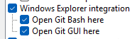
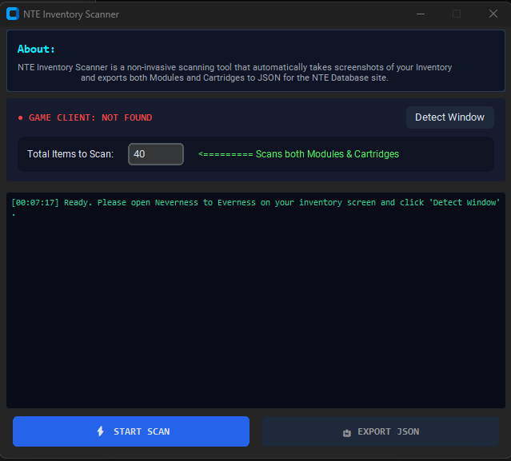

# NTE Inventory Scanner - An open source scanner for NTE designed to be imported to NTE Database
## Why build an open source scanner?
After finishing my site and wiring everything together, I realized that there was still a major hurdle to using the Optimizer - most players won't want to import every Module and Cartridge manually.
Should you trust an executable file? Let's recall the first things we learned as kids:
1. Look both ways before you cross the road.
2. *Something else*
3. Let people out of an elevator before you get in.
4. ***Never trust an executable file from the internet.***

The reason I built this and made it public was so anyone who wants to use it can clone it, dig through the files and confirm that there's no malware or malicious code hidden inside. The scanner is non-invasive and doesn't touch any game files, so there's no risk of bans.


## General Pipeline & Project Structure
The project houses the main components of the scanner:
1. `app.py` - CustomTkinter graphical application and orchestration
2. `core/capture.py` - Window finding and high-performance screen capture (mss)
3. `core/detector.py` - RapidOCR card detection and stat parser
4. `core/exporter.py` - JSON formatter for the NTE Database Optimizer
5. `core/navigator.py` - Grid navigation, slot clicking, and page scrolling
6. `core/merger.py` / `merge_scans.py` - Utility to combine multiple batch scans into one master JSON file

Each of these last four files are packed into a CustomTkinter shell by app.py to collectively grab an image of a Module or Cartridge in your Inventory, click on the next one, rinse and repeat {x} amount of times (set by you), parse the shapes/words/numbers from each image and export everything to a custom json that can subsequently be uploaded to the site's Inventory systems.

## Installation

There are generally two options available to you.

### Option 1: Downloading the Executable
For those who don't want to bother with installing Python, the dependencies and working from a CLI, the executable can be found in [Releases](https://github.com/H311crozz/NTE-Inventory-Scanner/releases).

### Option 2: Running from Source
#### Requirements:
1. [Git](https://github.com/git-for-windows/git/releases/download/v2.55.0.windows.5/Git-2.55.0.5-64-bit.exe)
**Note: Ensure you select "Add to Path" during installation to allow for Git commands in the CLI or select "Open Git Bash here"**



2. [Python](https://www.python.org/ftp/python/3.14.7/python-3.14.7-amd64.exe)
**Note: Ensure you select "Add Python to Path" during installation**

#### Clone the repo:
```bash
git clone https://github.com/H311crozz/NTE-Inventory-Scanner.git 
cd NTE-Inventory-Scanner
``` 

#### [Recommended] Create a Virtual Environment:
```bash
python -m venv .venv
.venv\Scripts\activate
```

#### Install dependencies:
```bash
pip install -r requirements.txt
```

#### Run the app:
```bash
python app.py
```

## Usage
After the program opens, you'll see the basic interface: 


Generally the program will be able to auto-detect your game process, but you can click "Detect Window" if for some reason it hasn't on startup. You can also select how many Modules/Cartridges you'd like to scan before continuing with the scanning process. 

Best practices are to have the game open, then tab over to the Inventory Scanner and click "Start Scan". The scanner will then pull your game process forward and begin the process of clicking on the first Module or Cartridge, capture it, click on the next one, capture, etc. When it reaches the end of a current page, it will automatically scroll (if you've selected to scan enough items to warrant it.)

After the scanning is done, you'll see an option to export to json, which is the format that NTE-Database takes for its inventory files.
 
### Merging Multiple Batch Scans [NEW!]
If you prefer to scan your inventory in batches (e.g., scanning Cartridges first, or scanning different rarity filters across multiple sessions), you can combine multiple JSON exports into a single master file:

- **Via GUI:** Click the **"🔀 MERGE JSONs"** button on the scanner interface. Select two or more `.json` files (hold `Ctrl` or `Shift` to pick multiple), choose where to save your `master_inventory.json`, and the scanner will automatically combine them, re-index IDs, and remove any duplicate scans.
- **Via Standalone Script:**
  - **Double-click:** Run `merge_scans.py` directly to open a native file picker dialog.
  - **CLI:** 
    ```bash
    python merge_scans.py batch1.json batch2.json batch3.json -o master_inventory.json
    ```

## Demo
[](https://youtu.be/WbNklLjxjws)


